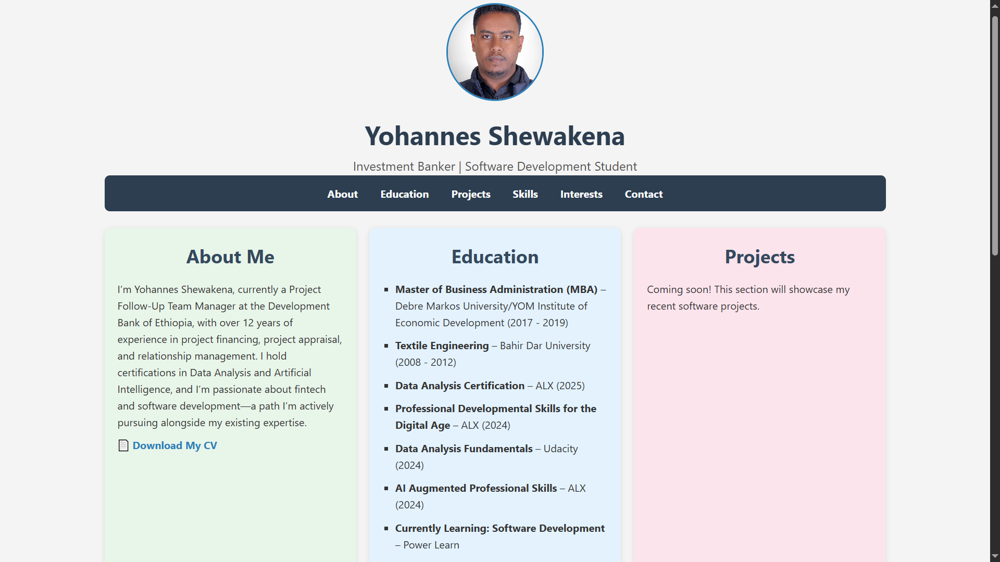
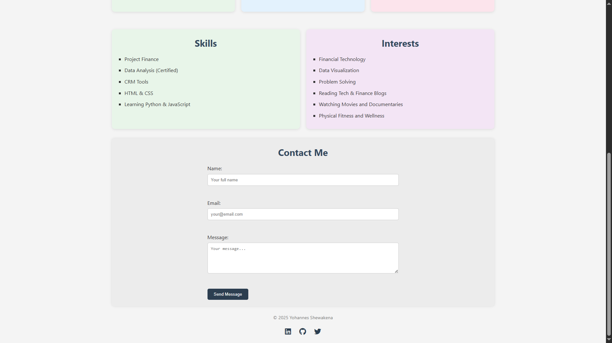

# Yohannes Shewakena | Portfolio Website

This is a personal portfolio website built with **HTML** and **CSS** to showcase my professional background, education, skills, interests, and contact information.

## 📁 Project Structure

```
portfolio/
│
├── assets/                    # Images, PDF Resume, etc.
│   ├── profilepic.jpg
│   |── Yohannes Shewakena_Resume.pdf
|   |── image.png
│   |── image1.png
|
├── portfolio.html             # Main HTML file
├── portfolio.css              # Custom CSS stylesheet
└── README.md                  # Project documentation (this file)
```

## 📌 Features

- Responsive layout using Flexbox
- Clean, professional UI with soft color palette
- Sectioned navigation for:
  - About Me
  - Education
  - Projects
  - Skills
  - Interests
  - Contact Form
- Downloadable CV link
- Font Awesome social icons
- Visually separated sections with shadow and spacing

## 🎨 Technologies Used

- HTML5
- CSS3
- Font Awesome (via CDN)

## 📷 Screenshot

 

## 🚀 How to Use

1. Clone the repository.
2. Make adjustments
3. Open `portfolio.html` in any browser.
4. To make it public:
   - Upload to [GitHub Pages](https://pages.github.com/)
   - Or host via [Netlify](https://www.netlify.com/) / [Vercel](https://vercel.com/)

## 📬 Contact

If you’d like to connect, feel free to reach out:

- **Email:** [Your Email Here]
- **LinkedIn:** [linkedin.com/Yohannes-Shewakena](https://linkedin.com/Yohannes-Shewakena)
- **GitHub:** [github.com/John-Shewa2](https://github.com/John-Shewa2)
- **Twitter (X):** [x.com/John4shewa](https://x.com/John4shewa)

---

© 2025 Yohannes Shewakena
